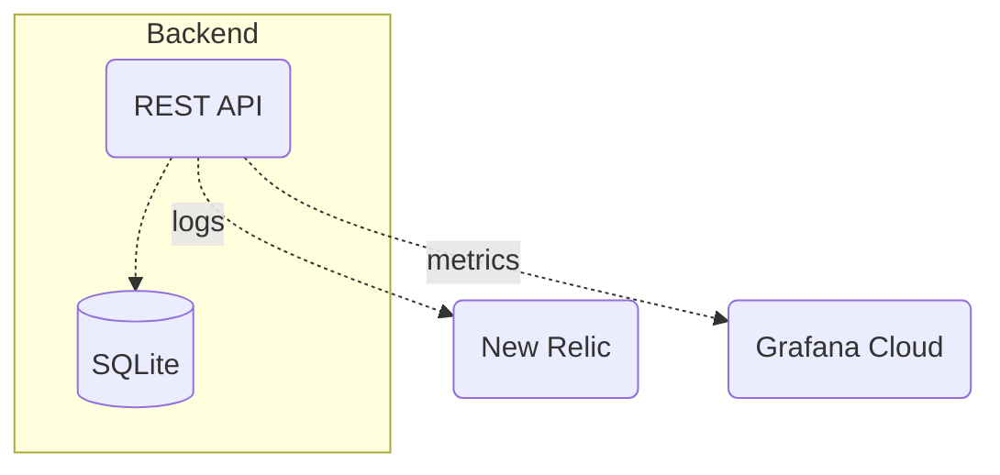

# Rango (GraalVM Edition)

Rango is a REST API for school canteen management.



## Local Deployment (Docker)

You can run the application locally using Docker Compose.

Navigate to the `dev-resources/local_deploy` directory and run the following command:

You problably need to perform a docker login before running the command below (`docker login ghcr.io`).


```shell 
docker compose up -d migratus
```

After the database is created, run the following command:

```shell
docker compose up -d rango
```

## License

Copyright © 2024 Bruno do Nascimento Maciel

This program and the accompanying materials are made available under the
terms of the Eclipse Public License 2.0 which is available at
http://www.eclipse.org/legal/epl-2.0.

This Source Code may also be made available under the following Secondary
Licenses when the conditions for such availability set forth in the Eclipse
Public License, v. 2.0 are satisfied: GNU General Public License as published by
the Free Software Foundation, either version 2 of the License, or (at your
option) any later version, with the GNU Classpath Exception which is available
at https://www.gnu.org/software/classpath/license.html.
